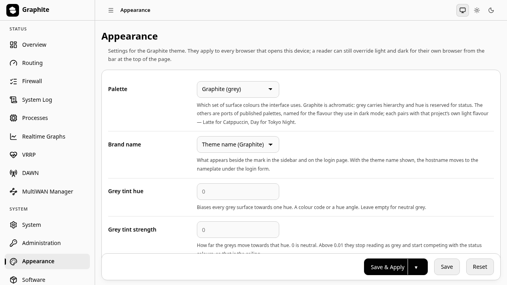

# luci-app-graphite

[English](README.md) · [简体中文](README.zh-CN.md)

The settings page for [luci-theme-graphite](https://github.com/Zakkaus/luci-theme-graphite).
It writes `/etc/config/graphite`; the theme reads that file and needs nothing else, so this
package is optional — install it to change the palette from the interface instead of over ssh.

It adds one page under **System → Appearance** with six options:

| Option | What it does |
|---|---|
| Palette | Which of the six palettes the interface uses |
| Accent colour | Colour of the primary button, focus ring, active badge and brand tile. One of eight names; empty leaves it off |
| Custom accent colour | A six-digit hex colour, winning over the option above under any palette |
| Brand name | The theme name or the device hostname, beside the mark |
| Tint hue | Shifts the greys toward a hue, in degrees |
| Tint strength | How far, from neutral to clearly tinted |

The accent's eight names are answered by each palette in its own values: Catppuccin from
each flavour's own accent list, Tokyo Night from its upstream palette, Graphite from a set
tuned for a grey interface. Changing palette therefore never leaves you with a colour that
does not belong to the set around it.

The two tint options exist because a palette decides the hue of the *status* colours, not
of the greys the rest of the interface is made of. They are the way to make an installation
recognisable without giving up the neutral ground everything else depends on.

## Install

`.apk` packages and an installer are published with the theme; see its README.
Building from source needs the same feed layout as the theme, since the Makefile
resolves `luci.mk` by real path.

## Licence

Apache-2.0. See [LICENSE](LICENSE).
