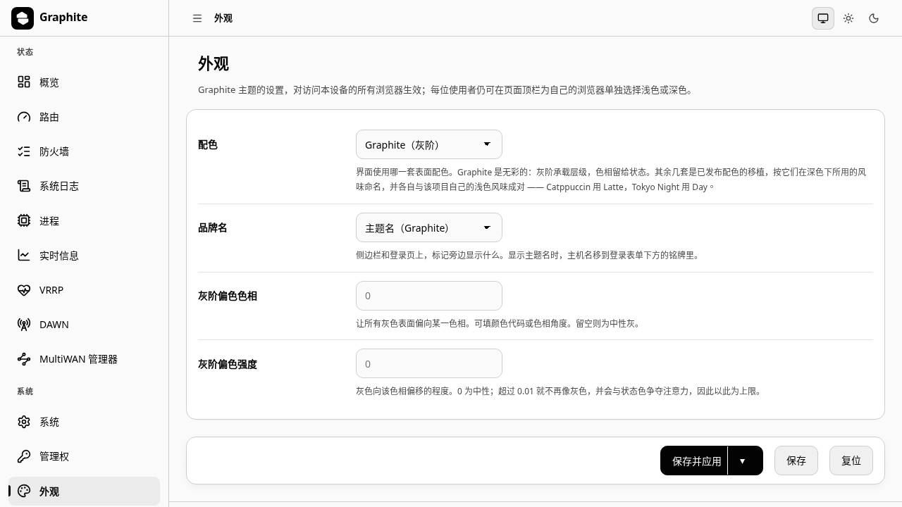

# luci-app-graphite

[English](README.md) · [简体中文](README.zh-CN.md)

[luci-theme-graphite](https://github.com/Zakkaus/luci-theme-graphite) 的设置页。
它写入 `/etc/config/graphite`，主题读这个文件，除此之外不需要别的，
所以这个包是可选的 —— 装上它，换配色就不必再登 ssh 改配置。

它在 **系统 → 外观** 下加一页，共四项：

| 选项 | 作用 |
|---|---|
| 配色 | 界面用六套配色中的哪一套 |
| 品牌名 | 标记旁边显示主题名还是设备主机名 |
| 灰阶偏色色相 | 把灰阶往某个色相偏，单位为度 |
| 灰阶偏色强度 | 偏多少，从中性到明显带色 |

后两项之所以存在，是因为一套配色决定的是**状态色**的色相，
而不是界面其余部分所用的灰阶的色相。它们让一台设备一眼可辨，
同时保住其余一切所依赖的中性底色。

## 安装

`.apk` 包和安装脚本随主题一同发布，见主题的说明。
从源码构建需要与主题相同的 feed 目录结构 —— Makefile 按真实路径解析 `luci.mk`。

## 许可

Apache-2.0，见 [LICENSE](LICENSE)。
